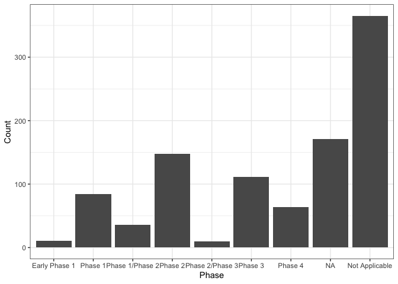

<!-- README.md is generated from README.Rmd. Please edit that file -->

# bis620.2023

<!-- badges: start -->

[](https://github.com/YRblack/bis620.2023/actions/workflows/R-CMD-check.yaml)
[](https://github.com/YRblack/bis620.2023/actions/workflows/test-coverage.yaml)
<!-- badges: end -->

The bis620.2023 package is developed as an extension of our midterm
project in BIS 620 Fall 2023. This package is structured to encompass a
comprehensive suite of functions and datasets used in our midterm
project.

Core Functionality: The core of the bis620.2022 lies the `start_shiny`
function. This function serves as a gateway to an interactive Shiny
application, designed to provide an user-friendly interface for
exploring the extensive data from clinicaltrials.gov trials. The
application is tailored to facilitate in-depth analysis and
visualization of clinical trial data.

## Installation

You can install the development version of bis620.2023 from
[GitHub](https://github.com/) with:

``` r
# install.packages("devtools")
devtools::install_github("YRblack/bis620.2023")
```

## Example

This is an example which we use in the shinyapp to show different phases
of studies:


